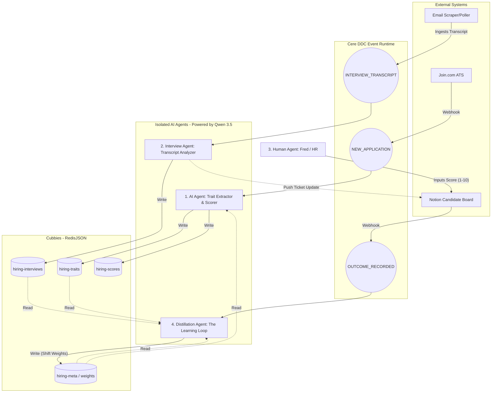

# ADR: Candidate Trait Extraction & Compound Intelligence Loop

**Date**: March 2, 2026  
**Status**: Implemented (Demo Prototype Live)  
**Authors**: Martijn, Fred Jin, Sergey  

## The Goal
The core objective is to move from a standard ATS (unstructured candidates treated equally) to an **AI-driven pattern-matching engine** using the Cere DDC Network. 

We need to ingest candidates from ATS webhooks, vectorize their nuanced traits (e.g., hard things they've built, open source contributions), and store them in Cere Cubbies. The system must feature a **closed feedback loop** (Compound Intelligence): as human interviewers provide a final score (1-10) in Notion, the system autonomously recalculates how heavily it weighs certain traits, making the screening process continuously smarter.

---

## 1. The Curriculum & Journey

The implementation evolved iteratively, strictly following the AI Coding Workshop curriculum to ensure robust architectural constraints and testing.

### Phase 0: The Constitution
We established `.specify/memory/constitution.md` to dictate the rules of engagement.
*   **Spec-Driven Development:** No implementation without prior review.
*   **Cubby Abstraction:** All state must persist in Redis-backed hierarchical Cubbies using the SDK.
*   **Agent Isolation:** Single-responsibility agents communicating via RAFT events, never direct function calls.

### Phase 1: Candidate Intake & Vectorization
We moved from static LLM prompts to an event-driven `Trait Extractor` agent that normalizes unstructured resumes into a deterministic schema within the `hiring-traits` Cubby.
🔗 **[Merged PR #1: spec: 001-bridge-traits-cubby](https://github.com/cere-io/HiringPipeline/pull/1)**

### Phase 2: Compound Intelligence & Demo UI
We implemented the `Scorer` agent and `Distillation` agent. Due to instability in the local `ddc-node` dev branch, we built a Next.js Mock DDC Runtime to serve as a functional "Track A" prototype. This UI successfully demonstrates the real-time weight shifting loop triggered by simulated Notion webhooks.
🔗 **[Open PR #2: feat: Compound Intelligence Pipeline PoC](https://github.com/cere-io/HiringPipeline/pull/2)**

---

## 2. The Final 4-Agent Architecture

The target production state leverages 4 isolated AI agents, executing in the V8 sandboxes of the Cere Event Runtime, bridged by the `hr-2026-e2e` backend infrastructure.

1. **AI Agent (Trait Extractor & Scorer)**
   *   **Trigger:** Receives `NEW_APPLICATION` events (via Join webhooks).
   *   **Action:** Extracts the 9-dimensional trait schema from the resume text using Qwen 3.5 open-source models natively. It calculates an initial composite score based on the current active role weights.
   *   **Storage:** Writes to `hiring-traits` and `hiring-scores` Cubbies.

2. **Interview Agent (Transcript Analyzer)**
   *   **Trigger:** Triggered by an email scraper/poller in the `hr-2026-e2e` system that ingests interview transcripts sent via email.
   *   **Action:** Ingests the raw transcript, evaluates it against a specific template using Qwen 3.5, and scores verbal signals, communication clarity, and technical depth.
   *   **Storage:** Pushes the analysis back to the candidate's ticket and writes the structured dimensions to the `hiring-interviews` Cubby.

3. **Human Agent (Notion Integration)**
   *   **Trigger:** Action taken by Fred or the hiring team in Notion.
   *   **Action:** A `page.updated` webhook from the Notion Candidate Board fires to the backend, capturing the human evaluation score (1-10).
   *   **Event:** Emits the `OUTCOME_RECORDED` event to the DDC network.

4. **Distillation Agent (The Learning Loop)**
   *   **Trigger:** Receives the `OUTCOME_RECORDED` event.
   *   **Action:** The orchestrator of compound learning. It reads the initial AI traits + the Interview Agent's transcript analysis. If the human score was high, it shifts the mathematical role weights towards that candidate's dominant traits. If low, it penalizes them.
   *   **Storage:** Writes the new, smarter weights back to the `hiring-meta` Cubby for the AI Agent to use on the *next* candidate.

---

## 3. Data Flow Visualization

## Next Steps

1. **Demonstrate Prototype:** Review the local Next.js Mock Runtime to validate the extraction schema and the compound intelligence weight-shifting math.
2. **Integration:** Hook up the live Notion `page.updated` webhooks from the `hr-2026-e2e` system to trigger the `Distillation` loop natively.
3. **Deployment:** Await the stabilization of the `ddc-node` repository to compile and upload the TypeScript agents into the true V8 Isolates on the Devnet.